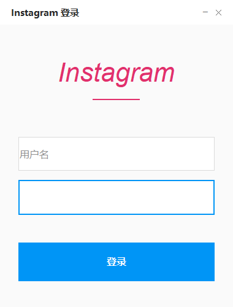

# 📱 Instagram 登录 GUI

<div align="center">
  
  
  
  
  
</div>

<div align="center">
  <h3>🎯 一个优雅的Instagram登录自动化工具</h3>
  <p>具有现代化UI设计和智能自动填充功能的Instagram登录助手</p>
</div>

---

## ✨ 主要特性

### 🎨 **现代化界面设计**
- 🎭 Instagram官方配色方案
- 🖼️ 自定义标题栏和窗口控制
- 💫 优雅的悬停效果和动画
- 📱 响应式布局设计

### 🤖 **智能自动化功能**
- 🔄 **全自动登录**: 自动填充用户名、密码并点击登录
- 🧠 **智能浏览器检测**: 优先Edge → Chrome → 默认浏览器
- 🎯 **多重元素定位**: 智能识别Instagram登录表单
- 📊 **登录结果检测**: 自动判断登录成功或失败

### 🛡️ **安全可靠**
- 🔒 本地运行，数据不上传
- 🌐 浏览器保持打开，用户可控
- ⚡ 非阻塞界面，流畅体验
- 🔧 完善的错误处理机制

---

## 🖼️ 界面预览

<div align="center">
  
  <p><em>简洁优雅的Instagram风格登录界面</em></p>
</div>

---

## 🚀 快速开始

### 📋 系统要求

- 🖥️ **操作系统**: Windows 10/11
- 🐍 **Python**: 3.7 或更高版本
- 🌐 **浏览器**: Microsoft Edge 或 Google Chrome
- 💾 **内存**: 至少 4GB RAM

### 📦 安装步骤

#### 1️⃣ 克隆项目
```bash
git clone https://gitee.com/holliday/pythonProject.git
git checkout instagram
cd instagram-login-gui
```

#### 2️⃣ 安装依赖
```bash
# 基础依赖
pip install -r requirements.txt

# 或手动安装
pip install Pillow==10.0.1 requests==2.31.0 selenium==4.15.2
```

#### 3️⃣ 运行程序
```bash
python ui/instagramLogin.py
```

---

## 🎮 使用指南

### 🔧 基本使用

1. **启动程序**
   ```bash
   python ui/instagramLogin.py
   ```
   

2. **输入登录信息**
   - 在用户名框输入Instagram用户名/邮箱/手机号
   - 在密码框输入密码

3. **点击登录**
   - 程序会自动打开浏览器
   - 自动填充登录信息
   - 自动点击登录按钮
   - 显示登录结果

### 🎯 功能模式

| 模式 | 说明 | 适用场景 |
|------|------|----------|
| 🤖 **自动模式** | 完全自动化登录流程 | 日常快速登录 |
| 🌐 **普通模式** | 仅打开浏览器到登录页 | Selenium不可用时 |

