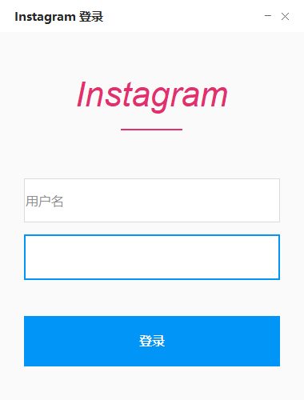

# 📱 Instagram 登录 GUI

<div align="center">
  
  
  
  
  
</div>

<div align="center">
  <h3>🎯 一个优雅的Instagram登录自动化工具</h3>
  <p>具有现代化UI设计和智能自动填充功能的Instagram登录助手</p>
</div>

---

## ✨ 主要特性

### 🎨 **现代化界面设计**
- 🎭 Instagram官方配色方案
- 🖼️ 自定义标题栏和窗口控制
- 💫 优雅的悬停效果和动画
- 📱 响应式布局设计

### 🤖 **智能自动化功能**
- 🔄 **全自动登录**: 自动填充用户名、密码并点击登录
- 🧠 **智能浏览器检测**: 优先Edge → Chrome → 默认浏览器
- 🎯 **多重元素定位**: 智能识别Instagram登录表单
- 📊 **登录结果检测**: 自动判断登录成功或失败

---

## 🖼️ 界面预览

```

```

---

## 🚀 快速开始

### 📋 系统要求

- 🖥️ **操作系统**: Windows 10/11
- 🐍 **Python**: 3.7 或更高版本
- 🌐 **浏览器**: Microsoft Edge 或 Google Chrome
- 💾 **内存**: 至少 4GB RAM

### 📦 安装步骤

#### 1️⃣ 克隆项目
```bash
git clone https://gitee.com/holliday/pythonProject.git
git checkout instagram
cd instagram-login-gui
```

#### 2️⃣ 安装依赖
```bash
# 基础依赖
pip install -r requirements.txt

# 或手动安装
pip install Pillow==10.0.1 requests==2.31.0 selenium==4.15.2
```

#### 3️⃣ 运行程序
```bash
python ui/instagramLogin.py
```

---

## 🎮 使用指南

### 🔧 基本使用

1. **启动程序**
   ```bash
   python ui/instagramLogin.py
   ```

2. **输入登录信息**
   - 在用户名框输入Instagram用户名/邮箱/手机号
   - 在密码框输入密码

3. **点击登录**
   - 程序会自动打开浏览器
   - 自动填充登录信息
   - 自动点击登录按钮
   - 显示登录结果

---

## 📁 项目结构

```
instagram-login-gui/
├── 📂 ui/
│   └── 📄 instagramLogin.py          # 主GUI程序
├── 📂 method/
│   ├── 📄 __init__.py                # 包初始化
│   ├── 📄 browser_manager.py         # 浏览器管理模块
│   └── 📄 web_automation.py          # 网页自动化模块
├── 📄 requirements.txt               # 项目依赖
├── 📄 build_exe.py                   # 打包脚本
├── 📄 build.bat                      # 批处理文件
├── 📄 test_auto_login.py            # 测试脚本
└── 📄 README.md                      # 项目说明
```

---

## ⚙️ 高级配置

### 🎛️ 自定义设置

#### 修改等待时间
```python
# 在 web_automation.py 中
self.wait_timeout = 15  # 默认10秒，可根据网络情况调整
```

#### 浏览器选项配置
```python
# 添加更多浏览器启动参数
chrome_options.add_argument("--start-maximized")
chrome_options.add_argument("--disable-notifications")
```

### 🔧 故障排除

#### 常见问题解决

| 问题 | 解决方案 |
|------|----------|
| 🚫 Selenium导入失败 | `pip install selenium==4.15.2` |
| 🌐 浏览器驱动错误 | 更新浏览器到最新版本 |
| 🔍 找不到登录表单 | 检查网络连接，等待页面完全加载 |
| ⚡ 程序运行缓慢 | 增加等待时间或检查系统资源 |

---

## 🏗️ 打包部署

### 📦 生成可执行文件

```bash
# 使用打包脚本
python build_exe.py

# 或使用批处理文件
build.bat
```

